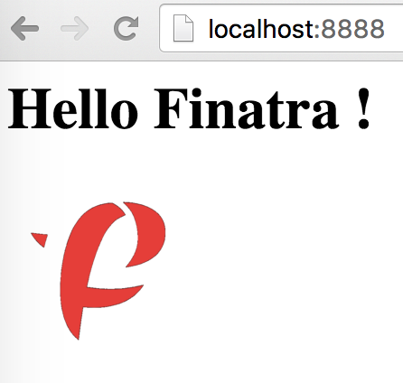
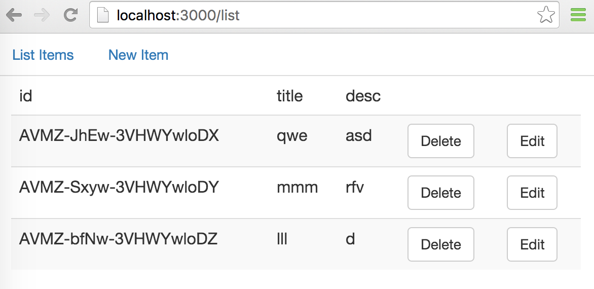
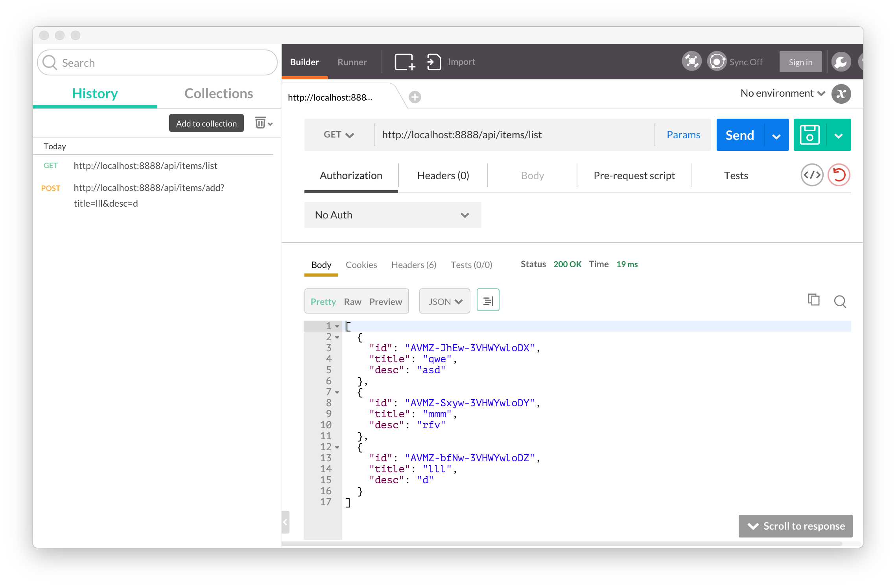

# APIs in Scala with Finatra, GraphQL and Angular2

References: 

[https://github.com/eddieLiu69/finatra-sangria-elastic4s-example](https://github.com/eddieLiu69/finatra-sangria-elastic4s-example)

[https://github.com/tapatron/learning-finatra-slick-angular2](https://github.com/tapatron/learning-finatra-slick-angular2)